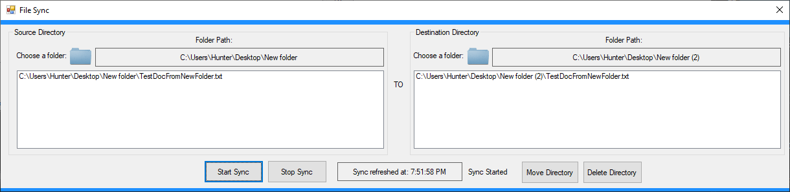

# FileSync - Windows Forms

A basic application made with C# and Windows forms that syncs the contents from the source directory to the destination directory
using a file system watcher. Able to move the contents from the source directory or delete the source directory. 

Made as part of a final project in *Fall 2016* for an introduction t dkestop app development class:

  * **NOTE:** Since this application was made for an intro class, it's recommended to run file sync on small directories.

Other projects created for the final include (all created with C# Windows Forms):

* Simple login program using a SQL local database with Visual Studio. The solution contains each one of the other 3 projects created for the final as a separate form once the user logs in.  
***Link to source***: https://github.com/hjohnson12/LoginPanel
  * ***NOTE***: If there are any updates to *FtpConnect*, *TextEditor*, and *FileSync*, they will be done in the according repositories. 
  * May update the repositories to include Windows 10 Universal Windows Platform controls once Xaml Islands fully release

* Basic application that connects to a ftp server and does simple operations such as read contents in a directory, upload a file,
and delete a file. 
***Link to source***: https://github.com/hjohnson12/FtpConnect  

* Text Editor application written in C# and Windows Forms. 
***Link to source***: https://github.com/hjohnson12/TextEditor 

***NOTE: This version is not currently being worked on***
  * May add new controls with Xaml Islands at some point

### Screenshots

##### Sync files from source directory to destination directory when notified there is a change by file system watcher. 

* Able to move source directory to destination directory or delete source directory

### Prerequisites

Requires *Visual Studio 2017 or higher* to run the application.

## Built With

* C# Windows Forms

## Contributing

[Coming Soon]

## Authors

* **Hunter** - *Initial work* - [hjohnson012](https://github.com/hjohnson012)

See also the list of [contributors](https://github.com/hjohnson12/FileSync/graphs/contributors) who participated in this project.

## License

This project is licensed under the MIT License - see the [LICENSE.md](LICENSE.md) file for details
